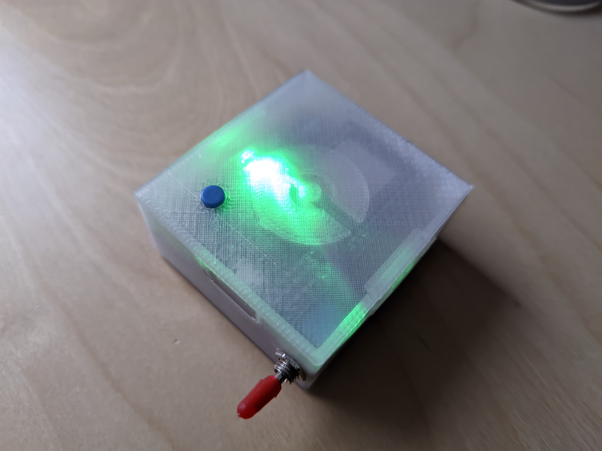
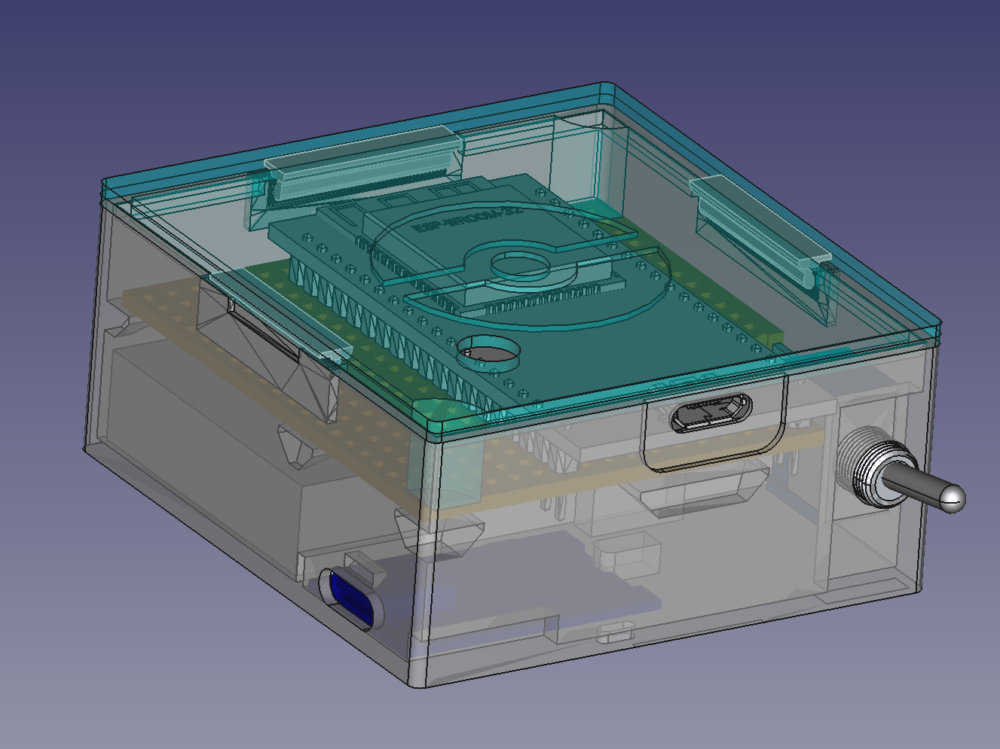
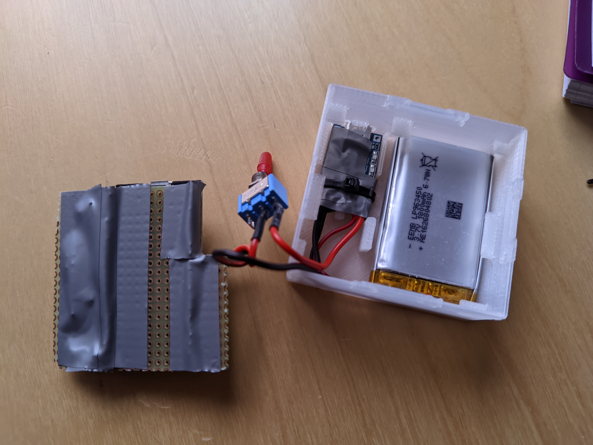
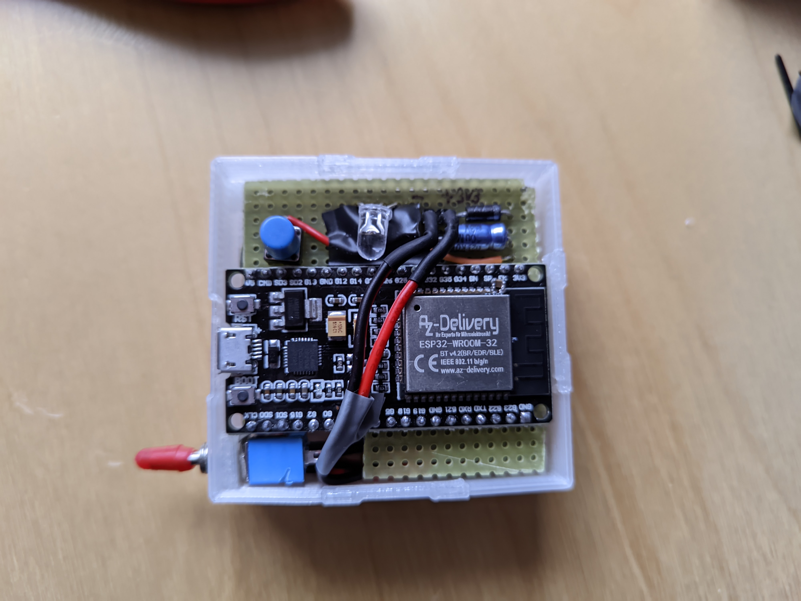
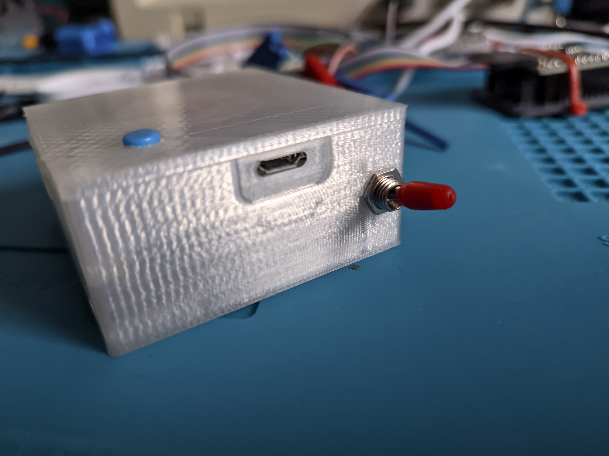
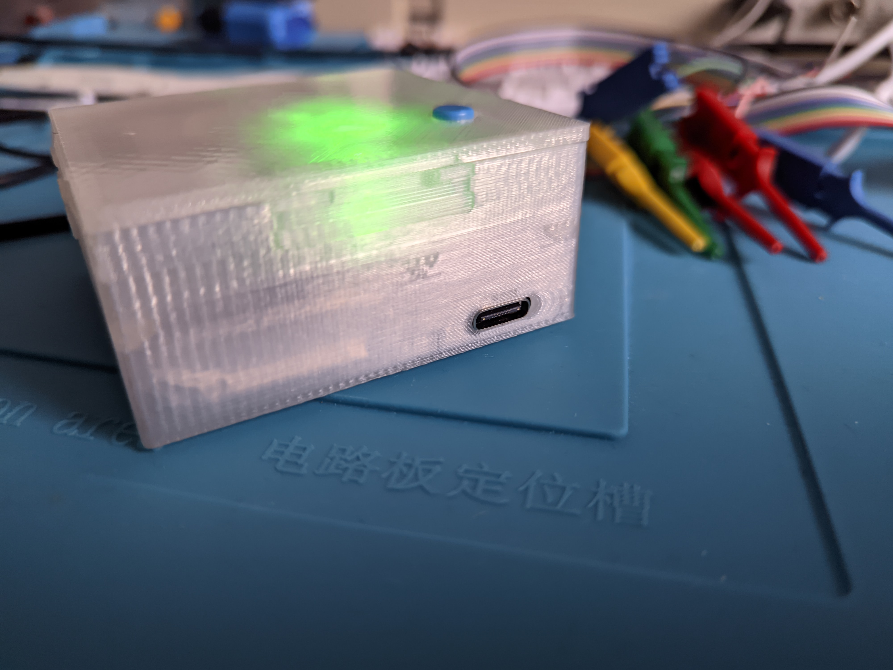

# pgpemu gadget

A portable [pgpemu](https://github.com/spezifisch/pgpemu) gadget with >40h battery life and charger.





## Usage

You can find the STL files in the `Output` directory.

When printing the bottom part make sure your slicer doesn't remove the thin wall around the ESP32 board's Micro USB port.

My print settings: 0.2mm layer height, 20% infill, transparent PLA.

See assembly notes at the end of this document.

## Development

Requirements:

- FreeCAD 0.20+
- [Assembly4](https://github.com/Zolko-123/FreeCAD_Assembly4)

The main file is `pgpemu_case.FCStd`.

### BOM

- ESP32 board: [ESP32 NODEMCU Module WiFi Development Board with CP2102](https://www.azdelivery.de/en/collections/nodemcu/products/esp32-developmentboard)
- Charger: [USB-C 5V 1A TP4056 Lithium Battery Charger Module](https://aliexpress.com/item/1005004654476348.html)
- LiPo battery: [EEMB 3.7V Lipo Battery 1800mAh 963450](https://www.aliexpress.com/item/1005003318811101.html) (make sure to get a good one with a protection circuit)
- generic toggle switch, 5mm RGB LED + resistors, push button with extension cap, standard silicon diode, 10µF electrolytic capacitor (on the perfboard, after the diode), 10µF SMD 0805 ceramic capacitor (directly on the ESP32 module between its power and ground pins)

## Perfboard

Here are some notes if you're interested to do a similar board. Drop me a mail and I will make you a schematic if you need it.

### LiPo Safety

The first **important** message is: **Do not charge the battery while the device is turned on!** You need extra circuitry to do it safely, which I haven't included because *in my use case* it's not something that I need to do. The device will not explode immediately (hopefully) but this is bad practice, see the reference links below. I see many projects in the wild doing this haphazardly and using LiPo batteries unsafely without knowing better. Be smart and consider using the resources below if you really need this feature. FYI if you see a project that doesn't address this they could be skimping on safety.

Here are some very important considerations when using a LiPo charger:

- <https://emariete.com/en/co2-meter-with-battery-well-done/>
- <https://www.best-microcontroller-projects.com/tp4056.html>
- <https://www.best-microcontroller-projects.com/dw01a.html>

### Supply

The ESP32 has an operating range from 3.0V - 3.6V (see [datasheet p.46](https://www.espressif.com/sites/default/files/documentation/esp32_datasheet_en.pdf)).

The LiPo battery that I chose has a safety circuit which ensures the voltage is >=3.0V and <=4.28V (see [datasheet section 6.1.0](https://ru.eemb.com/public/Download/Rechargeable-Lithium-Battery/Li-Polymer-Battery/Standard-Version/LP963450.pdf)) but the TP4056 charger only charges until 4.2V anyway. Also note that we're charging with 1A and the battery supports this according to the datasheet.

Now I considered generating the ESP32's voltage using either a boost regulator (battery -> boost 5V -> 3.3V with LDO on the ESP32 board), a modern LDO with 0.3V dropout voltage directly (battery -> LDO 3.3V) or just using a standard silicon diode I had lying around anyway to get the battery's range into the ESP32's range (battery -> diode drops 0.7V -> ESP32).

I went with the diode to reduce part count so I get between 2.3V and 3.5V which is safe for the ESP32. I haven't had any issues with this but in any case I added the mentioned 10µF caps.

Note that while you *can't* have the device switched on while charging, you *can* connect the ESP32's Micro USB while charging with the switch in the *off* position. Looking at the [ESP32 board schematic](https://cdn.shopify.com/s/files/1/1509/1638/files/ESP-32_NodeMCU_Developmentboard_Schematic_korr.pdf) the `AMS1117` output would be connected with your diode's cathode so you won't get backward currents into the battery or USB port.

## Assembly

At the bottom the TP4056 is tied down using a cable tie (otherwise USB-C plug action would be quite harsh on it). I isolated it sparing the LEDs for good measure.

The battery is glued to the bottom with a small piece of adhesive tape to keep it from flapping in the breeze. I also added a small piece of foam above the battery (not pictured) and some isolating tape covering the pointy parts of the board.



The perfboard rests on top of that on the small holders at the sides.



The finished device, charging (while switched off, of course).


Micro USB closeup: Access to serial console and bootloader.



USB-C closeup: Charger access.



## License

Unless otherwise stated my work in this repository is [CC BY-NC-SA 4.0](https://creativecommons.org/licenses/by-nc-sa/4.0/).

## Attributions

The following 3rd party parts with their own licenses are included.

### `Parts/PerfBoard`

I included the PerfBoard generator source for OpenSCAD with my settings, original:

> This thing was created by Thingiverse user Chunkmunk01, and is licensed under cc.

<https://www.thingiverse.com/thing:2054310>

### `Parts/PinHeader`

I included the PinHeader generator source for OpenSCAD with my settings, original:

> This thing was created by Thingiverse user karfes, and is licensed under cc.

<https://www.thingiverse.com/thing:2051023>

### `Parts/ESP32 DevKit C.FCStd`

ESP32 module and Micro USB port are from:

```text
ESP-WROOM-32

Raphael F. Martins
February 25th, 2020
WROOM-32 FEATURE
SW2018
```

<https://grabcad.com/library/esp-wroom-32-2>

### `Parts/TP4056 battery charger USB-C.*`

USB port is from:

> This thing was created by Thingiverse user Legacy_Micro, and is licensed under cc.

<https://www.thingiverse.com/thing:5745963>

### `Parts/spdt-print-toggle-switch`

Source:

```text
SPDT print toggle switch - PCB Mount

Chrismettal - Binary-6
February 19th, 2022
```

<https://grabcad.com/library/spdt-print-toggle-switch-pcb-mount-1>

### `Parts/Lid Hook.FCStd` and Bottom Receptacle

Source:

```text
ESP32 DevKit Case
by bkgoodman January 25, 2020
```

<https://www.thingiverse.com/thing:4125952>

As used in:

```text
ESP32 DevKit Case Wroom az-delivery 38 PIN
by tispokes April 21, 2022
```

<https://www.thingiverse.com/thing:5361695>
